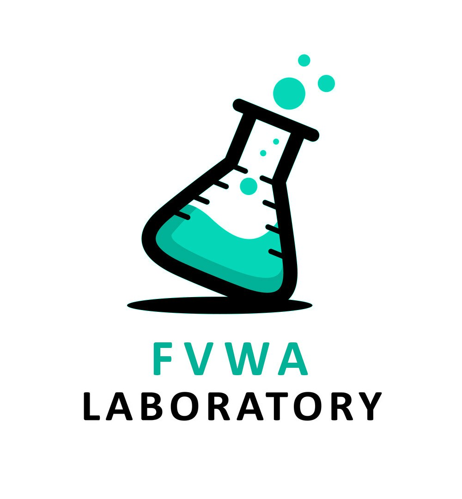

# FVWA (Flask Vulnerable Web Application)

## О проекте


Уязвимое веб-приложение, чтобы любой желающий мог попрактиковаться в разных уязвимостях и отточить свои навыки.


## Авторы
Данная лаборатория была сделала двумя русскими энтузиастами:
- [cherepawwka](https://t.me/CherepawwkaChannel)
- [SidneyJob](https://t.me/SidneyJobChannel)


## Описание
Приложение содержит 11 заданий на следующие темы:
- [1-3] Brute force
- [4] Fuzzing
- [5] SQLI
- [6] SSTI
- [7] JWT
- [8] IDOR
- [9] XXE
- [10] XSS
- [11] Бонусное задание — генерация Debugger PIN (при создании вдохновлялись исследованем [SidneyJob](https://t.me/SidneyJobChannel), опубликованным на [Habr](https://habr.com/ru/articles/738238/))


## Установка
```bash
git clone https://github.com/SidneyJob/FVWA.git
cd FVWA
sudo docker compose up -d
```

**Готово! Теперь лабаратория запущена у вас по адресу http://127.0.0.1:5001**
